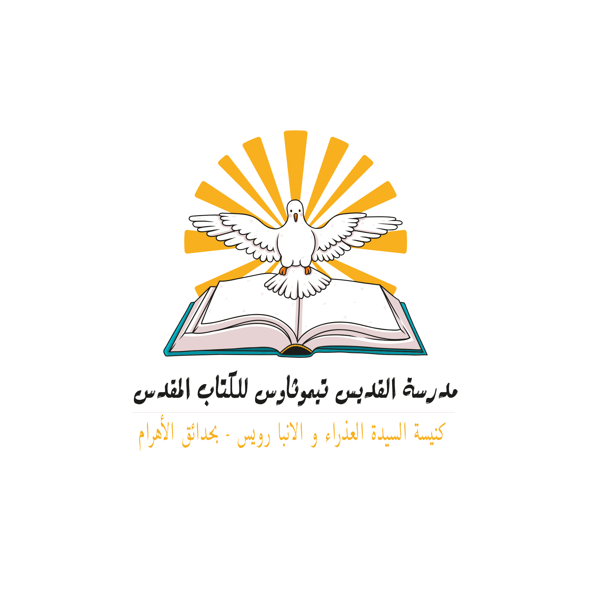

# ⛪ منصة مدرسة الكتاب المقدس الالكترونية — Bible School Management & E-Learning Platform

<p align="center">
  
</p>

<p align="center">
  <b>منصة إلكترونية متكاملة لإدارة مدارس الأحد ومدرسة الكتاب المقدس والأناشيد والأنشطة الكنسية</b><br>
  An end-to-end Laravel & EdTech E-Learning Solution designed specifically for Christian Education, Sunday Schools, and Bible Study Programs.
</p>

---

## 🌟 نظرة عامة (Overview)

**منصة مدرسة الكتاب المقدس** هي نظام إلكتروني متكامل يربط بين **إدارة الكنيسة**، **الخدام**، **الطلاب (المخدومين)**، و**أولياء الأمور**. توفر المنصة تجربة تعليمية وتفاعلية حديثة تدعم اللغة العربية والواجهات المتجاوبة (RTL)، مع نظام مكافآت ونقاط تشجيعية ومتابعة للمواظبة وحفظ الآيات.

---

## ✨ الأبواب والأدوار الرئيسية (Key Roles & Dashboards)

### 1. 🛡️ لوحة التحكم الإدارية (Admin Dashboard)
- إدارة الهيكل الأكاديمي (السنوات الدراسية، المراحل، الصفوف، الفصول).
- إدارة الحسابات (الخدام، الطلاب، أولياء الأمور) وتفعيل الحسابات الجديدة.
- رفع وإدارة المناهج والدروس والوسائط المرفقة (فيديوهات، ملفات PDF).
- إنشاء الامتحانات العامة ومتابعة نتائج الطلاب والتقارير الشاملة.

### 2. 👨‍🏫 لوحة الخادم (Servant Dashboard)
- تسجيل الحضور والغياب اليومي للطلاب بالفصل (يدوياً أو عبر QR Code).
- رصد النقاط والتشجيعات وإسناد الأوسمة والشارات.
- متابعة وتدقيق حفظ الآيات الأسبوعية وشرح الدروس.
- التواصل المباشر مع أولياء أمور طلاب الفصل.

### 3. 🎓 لوحة الطالب (Student Dashboard)
- قراءة ومتابعة الدروس والمناهج الدراسية والتفاعلية.
- حل الاختبارات والمسابقات الأسبوعية والامتحانات مع التصحيح التلقائي.
- متابعة الآية الأسبوعية ونظام الحفظ.
- استعراض لوحة الصدارة (Leaderboard) والأوسمة والنقاط ومعدل التتابع (Streak).
- كتابة وتأملات اليوميات الروحية (Spiritual Journal) وطلبات الصلاة.

### 4. 👨‍👩‍👧‍👦 لوحة ولي الأمر (Parent Dashboard)
- التنقل السلس بين حسابات الأبناء (Multi-child Switcher).
- متابعة نسبة حضور وغياب الأبناء وسجل درجات الاختبارات.
- الاطلاع على السلوك والنقاط المستحقة لكل ابن.
- التواصل المباشر والسريع مع خدام الفصل.

---

## 🚀 المميزات التقنية والفنية (Features & Tech Stack)

- **PHP 8.2+ & Laravel 11/10**: هيكلية برمجية معتمدة على أفضل ممارسات Laravel.
- **RTL Arabic Design System**: تصميم عصري بالكامل باللغة العربية باستخدام خطوط *Tajawal* و *Cairo*.
- **نظام الحضور الذكي (Smart QR Attendance)**: مولد وماسح ضوئي لرمز QR لتسجيل حضور الطلاب فوراً.
- **المذكرة الروحية وطلبات الصلاة**: متابعة قراءة الكتاب المقدس والصلوات الخاصة.
- **معرض الفعاليات والتسجيل**: متابعة الرحلات والمؤتمرات الكنسية وحجز الأماكن رفع الصور.
- **نسخة Google Apps Script (site script/)**: نسخة خفيفة تتيح تشغيل المنصة بالكامل عبر Google Sheets & Apps Script مجاناً!

---

## 🛠️ التثبيت والتشغيل المحلي (Installation & Setup)

```bash
# 1. استنساخ المستودع وتثبيت الاعتماديات
composer install

# 2. إعداد ملف البيئة
cp .env.example .env
php artisan key:generate

# 3. إنشاء قاعدة البيانات في MySQL وتشغيل الهجرة والبيانات الأولية (Database Seeders)
# (تأكد من تشغيل خادم MySQL وإجراء: CREATE DATABASE bible_school;)
php artisan migrate:fresh --seed

# 4. إنتاج رابط التخزين
php artisan storage:link

# 5. تشغيل السيرفر المحلي
php artisan serve
```

---

## 🔐 بيانات الدخول التجريبية (Demo Credentials)

| الدور (Role) | البريد الإلكتروني (Email) | كلمة المرور (Password) |
| :--- | :--- | :--- |
| **مسؤول النظام (Admin)** | `admin@bibleschool.com` | `password` |
| **خادم الفصل (Servant)** | `servant@bibleschool.com` | `password` |
| **الطالب (Student)** | `student@bibleschool.com` | `password` |
| **ولي الأمر (Parent)** | `parent@bibleschool.com` | `password` |

---

## 🧪 الاختبارات الآلية (Automated Tests)

لتشغيل الاختبارات وتأكد سلامة جميع مسارات التطبيق:

```bash
php artisan test
```

---

## 📜 الترخيص (License)

هذا المشروع مخصص لإدارة مدرسة القديس تيموثاوس للكتاب المقدس - التابعة لكنيسة السيدة العذراء و الانبا رويس بحدائق الأهرام.

