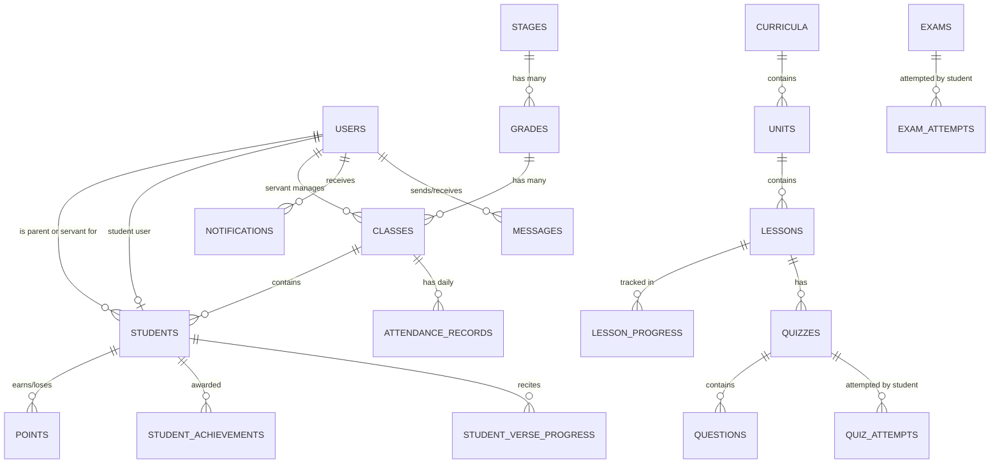

# Implementation Plan — Bible School Management & E-Learning Platform ("مدرسة الكتاب المقدس")

Transform `d:\bible school` into a complete, production-ready, full-stack Laravel Bible School Management & E-Learning platform featuring modern Arabic/RTL design, 4 role-based dashboards (Admin, Servant, Student, Parent), complete academic & curriculum management, quiz/exam engines, attendance tracking, gamified points/badges system, parent-servant messaging, report generation, and realistic seed data.

## User Review Required

> [!IMPORTANT]
> - The application will be bootstrapped in `d:\bible school` with Laravel 11/10.
> - Full Arabic RTL design system using modern typography (**Cairo** & **Tajawal**), sophisticated palette (Deep Navy `#0f172a`, Royal Blue `#1e3a8a`, Warm Gold `#d97706`, Ivory `#f8fafc`), responsive sidebar, mobile bottom navigation for students/parents, and micro-interactions.
> - Database configured with SQLite/MySQL support for seamless execution and deployment.
> - Real-world realistic seed data providing instant demo logins for all 4 roles.

## Architecture & Database Schema

## Proposed Changes

### Component 1: Laravel Application Bootstrap & Configuration
- Bootstrap standard Laravel app structure in `d:\bible school`.
- Configure `.env` for SQLite/MySQL compatibility, Arabic locale (`ar`), timezone (`Africa/Cairo` / `Asia/Riyadh`), app name `"مدرسة الكتاب المقدس"`.
- Setup authentication routes, controllers, session middleware, and custom policies/gates for RBAC (`admin`, `servant`, `student`, `parent`).

#### [NEW] Configuration & Core System Files
- `config/app.php`, `.env`, `routes/web.php`, `routes/auth.php`

---

### Component 2: Database Architecture, Migrations & Models
Create 22+ Eloquent models & migrations with full foreign keys, cascade rules, indexes, and mass-assignment attributes:

#### [NEW] Models & Migrations
- `User` (role: admin, servant, student, parent)
- `AcademicYear`
- `Stage`
- `Grade`
- `SchoolClass` / `ClassGroup`
- `StudentProfile`
- `Curriculum`
- `Unit`
- `Lesson`
- `LessonProgress`
- `Quiz`
- `Question`
- `QuizAttempt`
- `Exam`
- `ExamAttempt`
- `AttendanceRecord`
- `StudentPoint`
- `Achievement`
- `StudentAchievement`
- `BibleVerse`
- `StudentVerseProgress`
- `Notification`
- `News`
- `Event`
- `Message`

---

### Component 3: Database Seeders
Build comprehensive, realistic seeders with demo accounts:
- **Admin**: `admin@bibleschool.com` / `password`
- **Servant**: `servant@bibleschool.com` / `password`
- **Student**: `student@bibleschool.com` / `password`
- **Parent**: `parent@bibleschool.com` / `password`
- Seed stages, grades, classes, curriculum, units, lessons with memory verses, quiz questions, sample attendance, points history, badges, announcements, calendar events, and parent-servant messages.

#### [NEW] Seeders
- `DatabaseSeeder.php`
- `RoleAndUserSeeder.php`
- `AcademicStructureSeeder.php`
- `CurriculumSeeder.php`
- `QuizAndExamSeeder.php`
- `ActivityAndGamificationSeeder.php`

---

### Component 4: Controllers & Policies
Implement full server-side validation, authorization policies, and backend logic:
- `AuthController`: Login, logout, profile update, change password.
- `DashboardController`: Role-based routing to Admin, Servant, Student, and Parent dashboards with real database aggregations & Chart.js data formatting.
- `StudentController`: Full CRUD, search, filter, sort, paginate, student profile with 9 detailed sub-tabs.
- `ServantController`: Servant CRUD & class assignment.
- `ParentController`: Parent CRUD & multi-child linking.
- `AcademicController`: Academic Years, Stages, Grades, Classes CRUD.
- `CurriculumController`: Curricula, Units, Lessons CRUD + Student reading interface + progress marking.
- `QuizController`: Quiz builder, question management, student attempt & automatic grading.
- `ExamController`: Exam management & student exam taking engine.
- `AttendanceController`: Class attendance grid, bulk attendance submit, date picker, duplicate prevention.
- `PointController`: Award/deduct student points with audit log.
- `AchievementController`: Badge awarding.
- `VerseController`: Bible verse library & reciting progress checker.
- `NotificationController`: Notification center, mark as read, unread count.
- `NewsController`: News CRUD & public feed.
- `EventController`: Calendar & events.
- `MessageController`: Secure parent-servant direct messaging.
- `ReportController`: Comprehensive printable/exportable reports (Student, Class, Attendance, Exam pass rate).
- `LandingController`: Public homepage controller.

#### [NEW] Controllers & Policies
- `app/Http/Controllers/*`
- `app/Policies/*`
- `app/Http/Middleware/CheckRole.php`

---

### Component 5: Design System & Shared Views / Blade Components
Construct a stunning EdTech Arabic RTL Design System:
- CSS token system: Navy `#0f172a`, Royal Blue `#1e3a8a`, Gold Accent `#d97706`, Ivory `#f8fafc`.
- Google Fonts: `Cairo` & `Tajawal`.
- Blade components: `x-app-layout`, `x-public-layout`, `x-card`, `x-stat-card`, `x-button`, `x-badge`, `x-alert`, `x-table`, `x-modal`, `x-form-input`, `x-select`, `x-pagination`, `x-breadcrumb`.
- Header & Sidebar navigation tailored for each of the 4 roles.
- Mobile bottom navigation bar for Student and Parent views.
- Error views: `errors/404.blade.php`, `errors/403.blade.php`, `errors/500.blade.php`, `errors/419.blade.php`.

#### [NEW] Views & Layouts
- `resources/views/layouts/app.blade.php`
- `resources/views/layouts/public.blade.php`
- `resources/views/components/*`
- `resources/views/errors/*`

---

### Component 6: Dashboards & Role-Specific Pages
1. **Public Landing Page** (`/`): Hero banner, About, Educational Stages, Featured Lessons, News, Upcoming Events, Statistics counter, Testimonials, Contact form, Footer.
2. **Admin Dashboard** (`/admin/dashboard`): Greeting banner, 8 KPI statistics cards, 4 interactive Chart.js graphs, activity timeline, quick actions modal/links, full admin sidebar.
3. **Student Dashboard** (`/student/dashboard`): Greeting banner, curriculum progress bar, statistics, Continue Learning hero card, My Courses, Upcoming Exams, Recent Grades, Memory Verse of the week, Badges, Streak tracker (🔥 5 أسابيع متتالية), Notification list.
4. **Servant Dashboard** (`/servant/dashboard`): My Classes selector, Today's attendance widget, Class student performance table, Quick actions (Attendance, Add points, Create quiz), Servant navigation menu.
5. **Parent Dashboard** (`/parent/dashboard`): Multi-child switcher dropdown/tabs (👦 مارك / 👧 مريم), Selected child overview, Attendance calendar/stats, Quiz/Exam average grades, Points counter, Bible verse reciting status, Direct servant message trigger.

---

### Component 7: Full Modules & CRUD Interfaces
- **Student Management & Student Profile** (Overview, Attendance, Grades, Lessons, Quizzes, Exams, Points, Badges, Verses, Activity).
- **Servant Management & Parent Management**.
- **Academic Structure (Years, Stages, Grades, Classes)**.
- **Curriculum, Units & Lesson Reader**.
- **Quiz Engine & Exam Engine**.
- **Daily Attendance Logger**.
- **Points & Badges System**.
- **Bible Verses Reciting Tracker**.
- **News, Calendar Events & Parent-Servant Messages**.
- **Reports Module** (Student, Class, Attendance, Exam performance with print styles).

---

## Verification Plan

### Automated & Manual Verification
1. **Database & Migrations**:
   - Run `php artisan migrate:fresh --seed` to verify error-free execution.
2. **Routes & Policies**:
   - Run `php artisan route:list` to ensure all 40+ routes are registered properly.
3. **Role Authentication & Authorization**:
   - Test login with all 4 accounts (`admin@bibleschool.com`, `servant@bibleschool.com`, `student@bibleschool.com`, `parent@bibleschool.com`).
   - Verify non-admin accounts get redirected / blocked (403) when attempting unauthorized access.
4. **Interactive UI & Workflow Testing**:
   - Admin creating student/parent/servant/class/curriculum/lesson.
   - Servant logging attendance, awarding points, creating quiz.
   - Student reading lesson, completing lesson, taking quiz, viewing score.
   - Parent switching between children, checking attendance/grades, sending message to servant.
